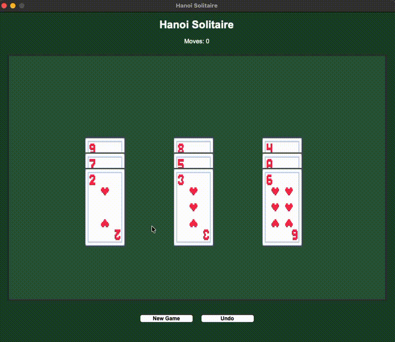

# Hanoi Solitaire 🃏

A Python-based implementation of Hanoi Solitaire with a graphical user interface. Built to practice object-oriented programming, game logic, and GUI development.




## 🎮 About the Game

Hanoi Solitaire is a strategic card game that combines elements of the classic Tower of Hanoi puzzle with solitaire mechanics. The objective is to move all 9 cards (Ace through 9) to a single pile in perfect descending order.

### Game Rules

- Start with 9 cards (Ace through 9) distributed across three piles
- **Goal**: Stack all cards on one pile in descending order (9 at bottom, Ace at top)
- **Movement Rules**:
  - Move one card at a time
  - Only top cards from each pile can be moved
  - A card can only be placed on a larger card or an empty pile
  - No card can be placed on a smaller card

### Win Condition
Successfully stack all cards in descending order: **9 → 8 → 7 → 6 → 5 → 4 → 3 → 2 → A**

## 🛠️ Tech Stack

- **Python 3.x** - Core game logic
- **Pygame** (or Tkinter) - GUI framework
- **pytest** - Testing framework
- **uv** - Modern Python package manager

## 🚀 Getting Started

### Prerequisites
- Python 3.10 or higher
- [uv](https://github.com/astral-sh/uv) package manager

### Installation

1. Clone the repository
```bash
git clone https://github.com/Nbk-Juno/hanoi-solitaire.git
cd hanoi-solitaire
```

2. Install dependencies
```bash
uv sync
```

3. Run the game
```bash
uv run python src/main.py
```

### Alternative: Using pip
```bash
pip install -r requirements.txt
python src/main.py
```

## 🧪 Running Tests
```bash
# Run all tests
uv run pytest tests/

# Run tests with coverage
uv run pytest tests/ --cov=src

# Run tests in verbose mode
uv run pytest tests/ -v
```

## 📁 Project Structure
```
hanoi-solitaire/
├── src/
│   ├── main.py           # Game entry point
│   ├── game.py           # Core game logic
│   ├── card.py           # Card class
│   └── gui.py            # GUI implementation
├── tests/
│   ├── test_game.py      # Game logic tests
│   └── test_card.py      # Card class tests
├── assets/
│   └── images/           # Card images and sprites
├── pyproject.toml        # Project dependencies
└── README.md
```

## 🎯 Learning Objectives

This project demonstrates:
- **Object-Oriented Programming**: Card, Deck, and Game classes with proper encapsulation
- **Game State Management**: Tracking card positions, valid moves, and win conditions
- **GUI Development**: Interactive graphical interface with event handling
- **Test-Driven Development**: pytest suite covering game logic and edge cases
- **Modern Python Tooling**: Using uv for dependency management

## 🔄 How to Play

1. Launch the game with `uv run python src/main.py`
2. Click on a card to select it
3. Click on a destination pile to move the card
4. Continue moving cards until all are stacked in descending order
5. Win message displays when puzzle is solved

## 📚 Resources

- [Tower of Hanoi Algorithm](https://en.wikipedia.org/wiki/Tower_of_Hanoi)
- [Pygame Documentation](https://www.pygame.org/docs/) (if using Pygame)

## 🙏 Acknowledgments

- Card graphics sourced from [[opengameart.org](https://opengameart.org/content/boardgame-pack)]
